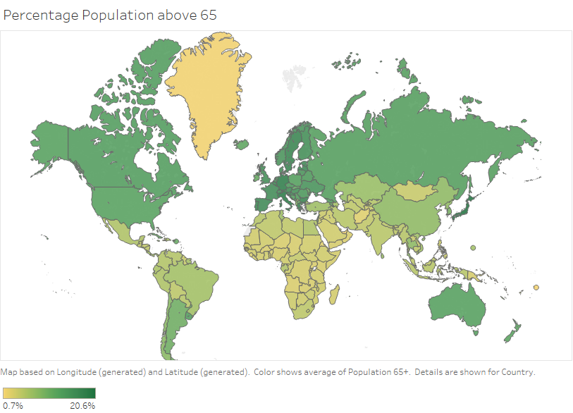

Tableau
----------------------

This repository contains visuals created using: 
1. World data like Population, Business, Health etc.
2. Data from a Store (Superstore.xls)

These visuals are Analyzed and Visualized using Tableau.

Population
----------------------

Countries with Average Population greater than 65 years of age:
